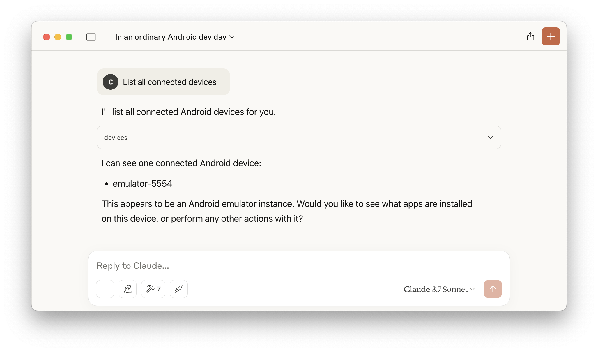
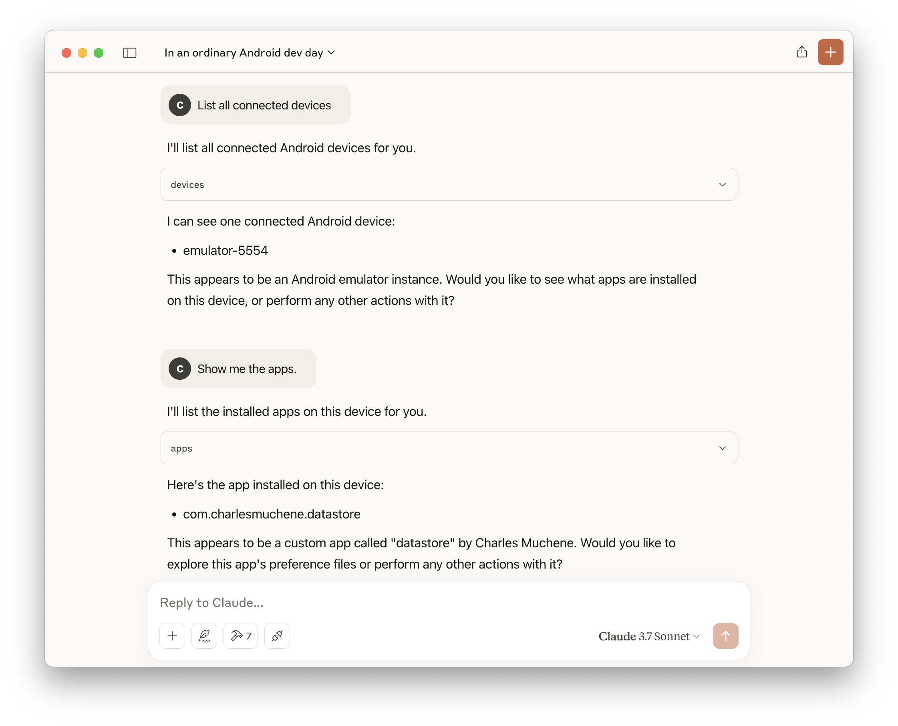

# Android-Preference-Editor MCP Server

This is an **MCP server** for [Android Preference Editor](https://github.com/charlesmuchene/pref-editor-js.git) tool.

## Requirements

- Android [adb](https://developer.android.com/tools/adb)

## Usage

Add this to the server configuration file:

```json
{
  "mcpServers": {
    "pref-editor": {
      "command": "node",
      "args": ["dist/index.js"]
    }
  }
}
```

## Demo

| Add a user preference                       | Available tools                              |
| ------------------------------------------- | -------------------------------------------- |
|  |  |

| List connected devices                             | List installed apps                          |
| -------------------------------------------------- | -------------------------------------------- |
|  |  |

## Features

The features exposed by this server are a _subset_ of the [Pref-Editor](https://github.com/charlesmuchene/pref-editor-js.git) operations.

## Build

`npm run build`

## License

See [LICENSE](./LICENSE)
