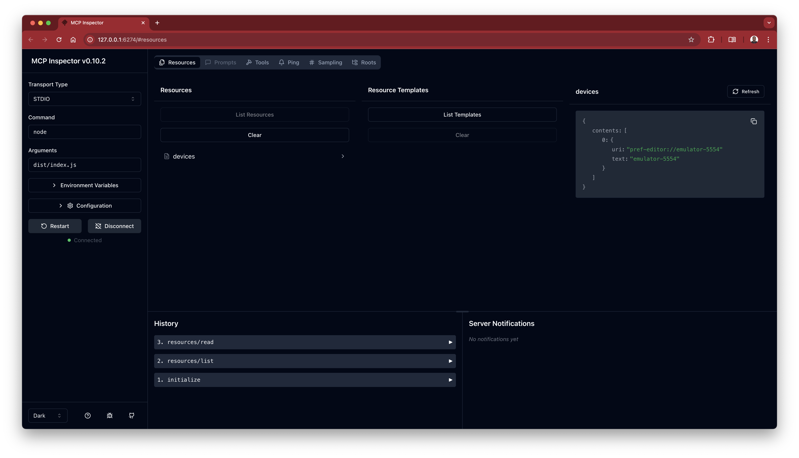
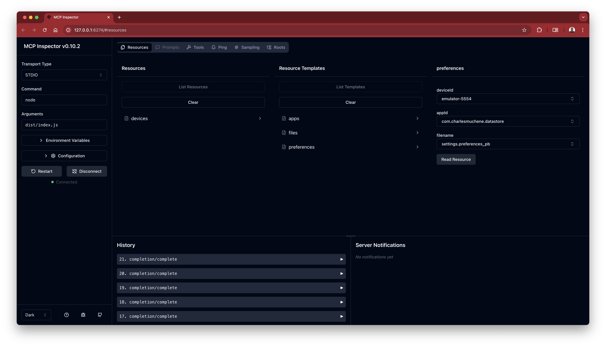
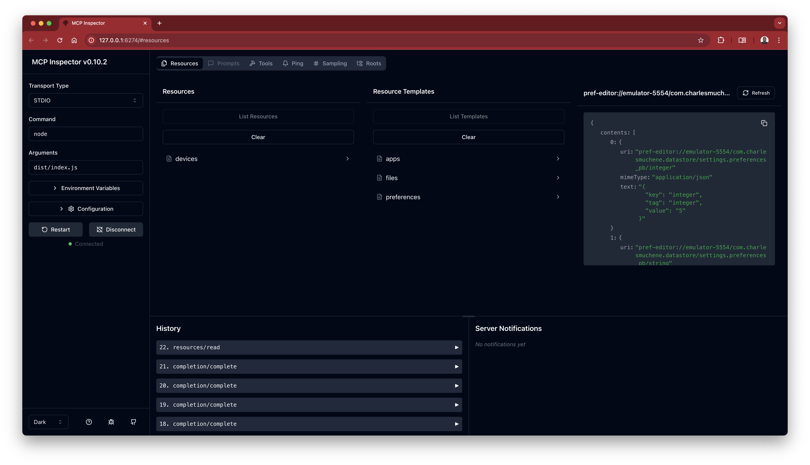
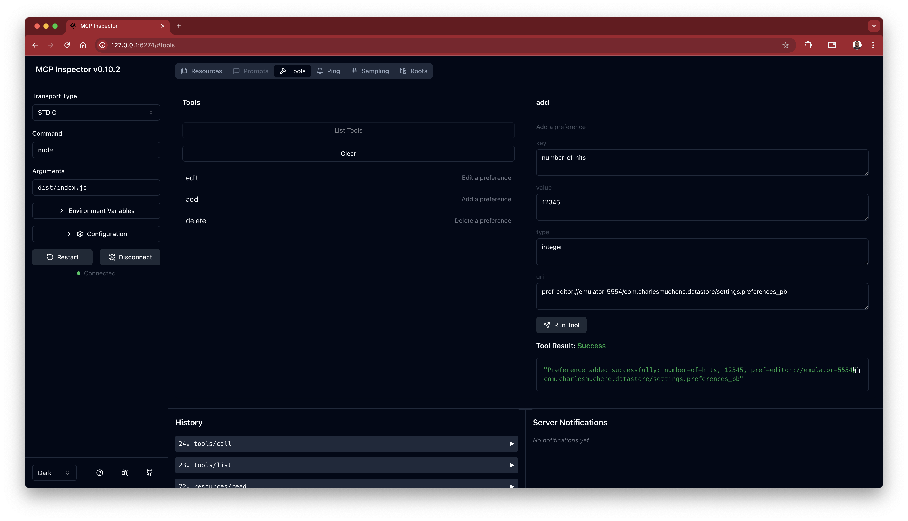

# Pref-Editor MCP Server

This is the [Pref-Editor](https://github.com/charlesmuchene/pref-editor-js.git) MCP server

## Usage

Add this to the server configuration file:

```json
{
    "mcpServers": {
        "pref-editor": {
            "command": "node",
            "args": [ "dist/index.js" ]
        }
    }
}
```

## Demo

| Connected Devices| Apps, Files, Preferences |
|-------------------------|-------------------------|
|  |  |

| Listing Datastore Prefs | Adding a preference |
|-------------------------|-------------------------|
|  |  |

## License

See [LICENSE](./LICENSE)
